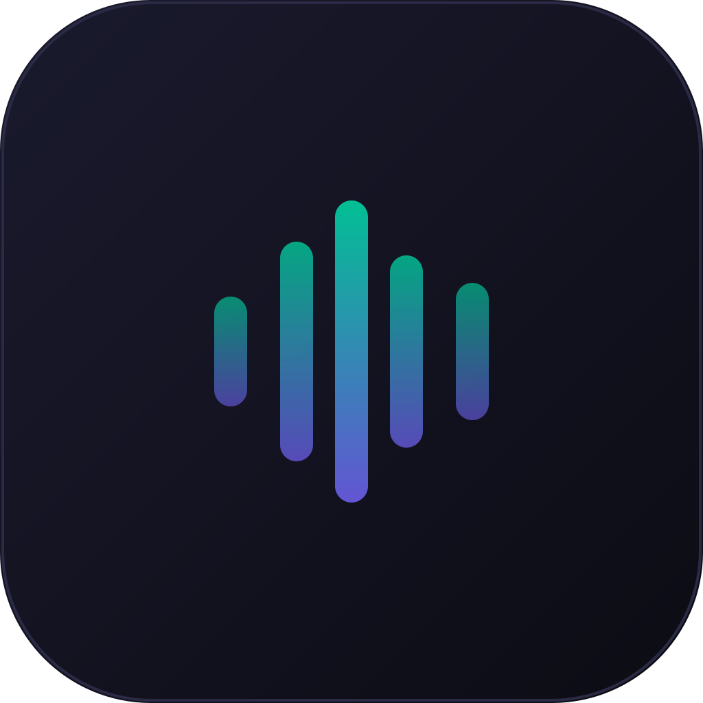
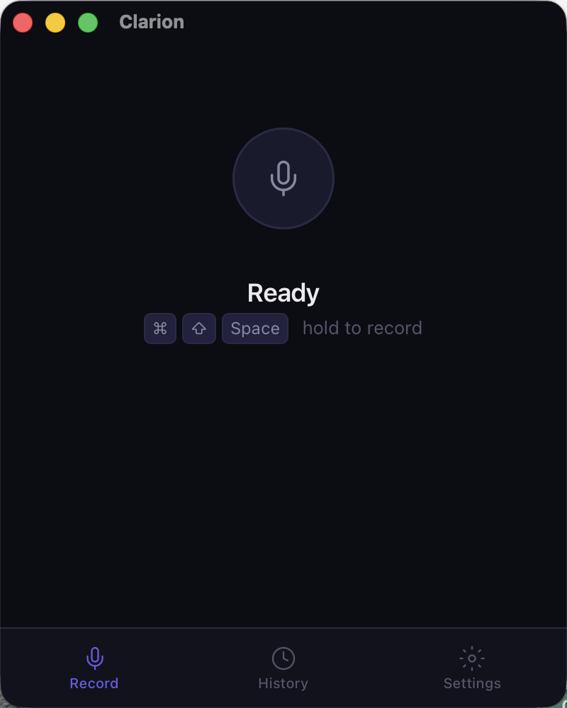
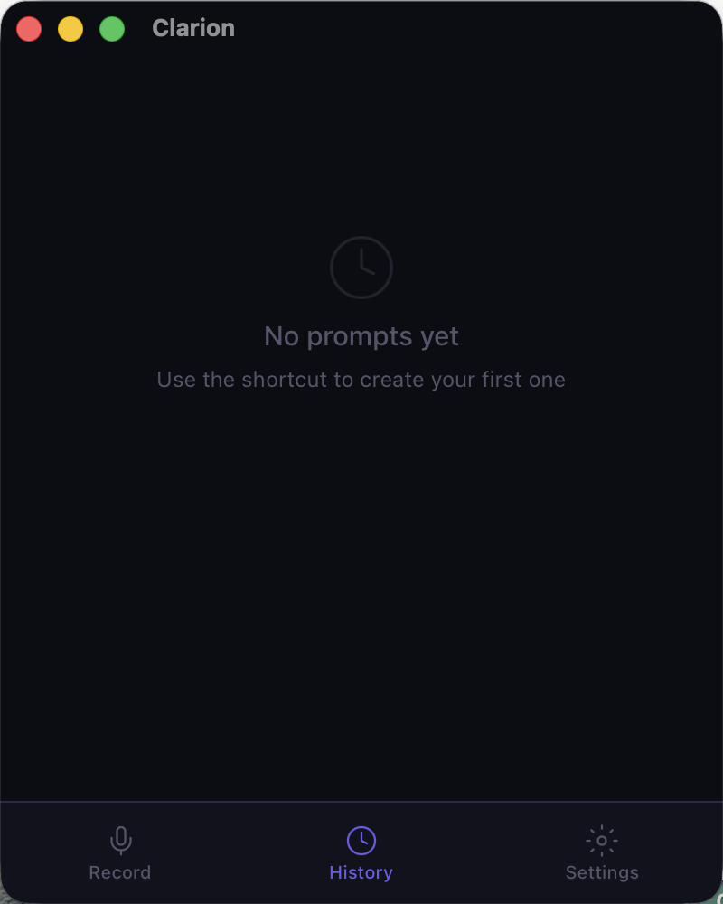
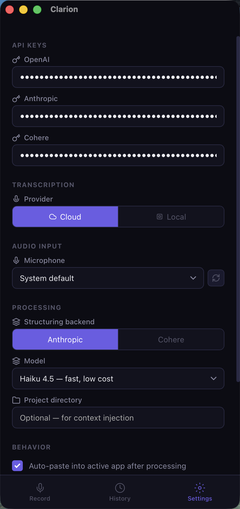

<div align="center">



# Clarion

**Hold a shortcut, speak in any language, get a well-structured English prompt pasted where your cursor is.**

[](https://github.com/mhsniranmanesh/Clarion/actions/workflows/ci.yml)
[](https://github.com/mhsniranmanesh/Clarion/releases)
[](LICENSE)


</div>

---

Developers who think in one language and code in another lose something in the gap. You
know exactly what you want the agent to do — but saying it in English, precisely, in
writing, is slower than thinking it. Clarion closes that gap: speak naturally in Farsi,
Arabic, Chinese, Russian, Spanish or French, mixed with English technical terms, and get
back a clean English prompt with every identifier intact.

```
Hold ⌘⇧Space → speak (any language + technical terms)
    → Whisper transcribes (cloud or local)
    → an LLM restructures it into a clear English prompt
    → result pasted into your active app
```

<div align="center">

&nbsp;&nbsp;

&nbsp;&nbsp;

</div>

Built with Tauri v2 (Rust backend, Svelte 5 frontend). ~5 MB, runs in the menu bar.

## Which model should structure your prompt?

That question is measured, not guessed. The structuring layer is pluggable — **Anthropic**
(Claude) or **Cohere** (the Command family and the 3.35B multilingual Tiny Aya models) —
and [`eval/`](eval/) is a harness that scores six models over 210 code-switched developer
utterances in six languages, using the exact prompt and sampling settings the app ships.

| Model | Identifier recall | Fully English | Format clean | Median latency |
|---|---|---|---|---|
| **Claude Haiku 4.5** *(default)* | **96.3%** | 100.0% | 100.0% | **1025 ms** |
| Command A Translate | 93.2% | 100.0% | 100.0% | 3381 ms |
| Tiny Aya Earth (3.35B) | 88.0% | 97.1% | 100.0% | 1014 ms |
| Tiny Aya Global (3.35B) | 88.0% | 98.6% | 100.0% | 1267 ms |
| Tiny Aya Water (3.35B) | 87.5% | 98.1% | 100.0% | 1143 ms |
| Command A+ | 86.9% | 94.8% | 100.0% | 8539 ms |

The headline metrics are deterministic, so anyone can recompute them from the committed
run files and get identical numbers. Meaning and prompt quality are judged by LLMs, blind,
with one judge per vendor and their disagreement reported rather than hidden.

**Caveat that governs every number above:** only Persian is native-speaker reviewed. The
other five languages are LLM-drafted and marked *not publishable* in every report until a
native speaker signs off. See [`eval/RESULTS.md`](eval/RESULTS.md) for the full report and
[`eval/README.md`](eval/README.md) for methodology and limitations.

## Install

### Download

> **No binary release is published yet.** Build from source below — it takes one command.
> The first signed release will appear on the Releases page.

Once one exists: grab the latest `.dmg` from the
[Releases page](https://github.com/mhsniranmanesh/Clarion/releases), drag Clarion to
Applications, and launch it.

On first run macOS will ask for two permissions — both are required:

- **Microphone** — to record your voice
- **Accessibility** — to paste the result into your active app

> If you see *"Clarion is damaged and can't be opened"*, the build you downloaded
> was not notarized. Run `xattr -cr /Applications/Clarion.app` to clear the
> quarantine flag, or build from source.

### From source

```bash
# Prerequisites: Rust, Node.js 18+, cmake (for local whisper)
git clone https://github.com/mhsniranmanesh/Clarion.git
cd Clarion
npm install
npm run tauri:build
```

The built app will be in `src-tauri/target/release/bundle/macos/Clarion.app`.

### Development

```bash
npm install
cp .env.example .env   # add your API keys
npm run tauri:dev      # launches the app with hot-reload
```

## Setup

1. Launch Clarion — it appears in your menu bar
2. Open Settings (click the tray icon, or the Settings tab)
3. Enter your API keys:
   - **OpenAI** — Whisper speech-to-text (cloud mode only)
   - **Anthropic** — Claude prompt structuring
   - **Cohere** *(optional)* — to use Cohere for structuring instead
4. *(Optional)* Switch transcription to **Local** and download a Whisper model for offline use
5. *(Optional)* Under Processing, switch the structuring backend between Anthropic and Cohere

Clarion only asks for the keys the providers you selected actually need — run local
Whisper with Cohere structuring and you never need an OpenAI key at all.

## Usage

1. **Hold `⌘ + ⇧ + Space`** — recording starts
2. **Speak** — any language, mixed with English technical terms
3. **Release** — Clarion transcribes, structures, and pastes the result

The structured prompt is also copied to your clipboard.

## Features

- **Multilingual** — speak Farsi, Arabic, Chinese, Russian, Spanish, French… mixed with English tech terms
- **Identifiers survive** — `useState` stays `useState`; the model translates prose, not code
- **Pluggable structuring** — Anthropic or Cohere, switchable in Settings
- **Cloud or local transcription** — OpenAI Whisper API, or local whisper.cpp (offline, free)
- **Model library** — Tiny (75 MB) through Large V3 Turbo (1.6 GB), downloaded on demand
- **Auto-paste** — result injected into your active app via simulated keystroke
- **Project context** — reads CLAUDE.md, README, package.json to understand your codebase
- **Prompt history** — browse and re-copy past prompts
- **Menu bar app** — runs in the background, click the tray icon to show or hide

## Configuration

### Environment variables (`.env`)

```
ANTHROPIC_API_KEY=sk-ant-...
OPENAI_API_KEY=sk-...
COHERE_API_KEY=...        # optional, for the Cohere structuring backend
```

These are defaults only. Settings saved in the app UI take precedence and persist to
`~/Library/Application Support/clarion/config.json`.

### Local Whisper models

| Model | Size | Speed | Accuracy |
|-------|------|-------|----------|
| Tiny | 75 MB | Fastest | Basic |
| Base | 142 MB | Fast | Good |
| Small | 466 MB | Moderate | Better |
| Medium | 1.5 GB | Slow | High |
| Large V3 Turbo | 1.6 GB | Moderate | Best |

Downloaded on demand from Hugging Face into `~/Library/Application Support/clarion/models/`.

## Architecture

| Path | What it is |
|---|---|
| `src-tauri/src/` | Rust backend — the whole pipeline |
| `src/App.svelte` | The entire frontend (one component, three views) |
| `prompts/structure_system.txt` | The structuring system prompt — single source of truth |
| `eval/` | Python harness measuring structuring quality across models |

The pipeline is `run_pipeline()` in `src-tauri/src/lib.rs`: record → transcribe →
structure → clipboard/paste → history. Phase transitions are emitted to the frontend as
`phase-changed` events; the frontend is a listener and never drives the pipeline.

The system prompt is compiled into the Rust binary with `include_str!` and read by the
Python harness from the same file, so a published benchmark cannot silently drift from
what the app ships. A parity test fails if the prompt, temperature or token budget ever
diverge between the two.

**Tech stack** — Tauri v2 (shell, tray, global shortcuts, IPC) · Rust (cpal audio capture,
whisper-rs, arboard, enigo) · Svelte 5 runes.

## Contributing

Issues and pull requests are welcome. See [CONTRIBUTING.md](CONTRIBUTING.md) for the
checks CI runs and the invariants worth knowing before you touch the pipeline.

## Releasing

Push a tag and [`release.yml`](.github/workflows/release.yml) builds a universal macOS
binary and opens a draft release:

```bash
git tag v0.1.0
git push origin v0.1.0
```

Signing and notarization are driven entirely by environment variables — no credentials
live in the repo. To produce a distributable build, set these as GitHub Actions secrets:

| Secret | Purpose |
|--------|---------|
| `APPLE_CERTIFICATE` | Base64-encoded Developer ID `.p12` |
| `APPLE_CERTIFICATE_PASSWORD` | Password for the `.p12` |
| `APPLE_SIGNING_IDENTITY` | e.g. `Developer ID Application: Your Name (TEAMID)` |
| `APPLE_ID` | Apple ID used for notarization |
| `APPLE_PASSWORD` | App-specific password for that Apple ID |
| `APPLE_TEAM_ID` | Apple Developer Team ID |

`APPLE_CERTIFICATE` is the only one that needs producing rather than looking up. Export
your Developer ID Application certificate from Keychain Access as a `.p12`, then:

```bash
base64 -i DeveloperID.p12 | pbcopy   # paste as the APPLE_CERTIFICATE secret
```

`APPLE_PASSWORD` is an [app-specific password](https://support.apple.com/en-us/102654),
not your Apple ID password. Find `APPLE_SIGNING_IDENTITY` with
`security find-identity -v -p codesigning`.

Without these the build still succeeds, but the app is unsigned and every user must clear
the quarantine flag by hand (see Install above) — which in practice means most of them
won't install it at all.

## Roadmap

- [ ] Custom shortcut configuration (currently fixed at `⌘⇧Space`)
- [ ] Native-speaker review for the five drafted eval languages
- [ ] Auto-detect the active project from VS Code / Cursor
- [ ] Auto-updater via GitHub Releases
- [ ] Windows + Linux support

## License

[MIT](LICENSE)
